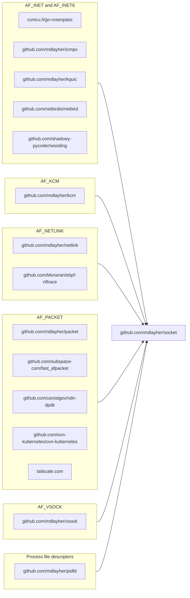

# socket  

Package `socket` provides a low-level network connection type which integrates
with Go's runtime network poller to provide asynchronous I/O and deadline
support. MIT Licensed.

This package focuses on UNIX-like operating systems which make use of BSD
sockets system call APIs. It is meant to be used as a foundation for the
creation of operating system-specific socket packages, for socket families such
as Linux's `AF_NETLINK`, `AF_PACKET`, or `AF_VSOCK`. This package should not be
used directly in end user applications.

Any use of package socket should be guarded by build tags, as one would also
use when importing the `syscall` or `golang.org/x/sys` packages.

## Ecosystem

Over time, an ecosystem of Go packages has developed around package `socket`.
Many of these packages provide access to a specific socket family, such as
`AF_NETLINK` or `AF_PACKET`, and act as building blocks for further packages.

To have your package included in this diagram, please send a pull request!

## Stability

See the [CHANGELOG](./CHANGELOG.md) file for a description of changes between
releases.

This package only supports the two most recent major versions of Go, mirroring
Go's own release policy. Older versions of Go may lack critical features and bug
fixes which are necessary for this package to function correctly.
